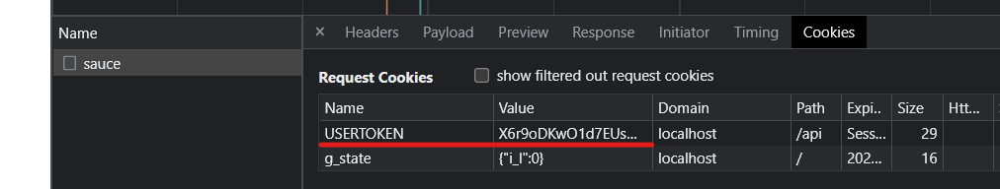
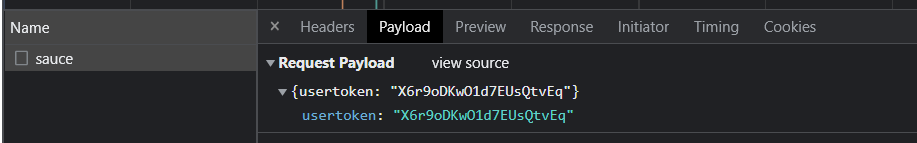
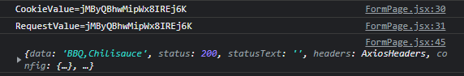
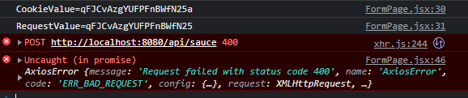
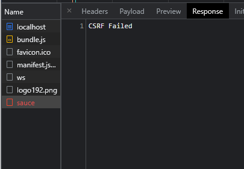

# CSRF-Research

## What is CSRF?

CSRF also known as Cross Site Request Forgery is that a domain can forge requests for another domain by modifying the parameters in a request.
A CSRF attack is very hard to spot, they might just look like a link or clickable image. But when you click on this link a malicious request can be sent to your api, like deleting your account.

This happens because the victim has an active session to a safe website, and for example simultaneously opens or visits a malicious site, or opens a fraudulent email sent to their account.
This malicious site or email then forges a HTTP request for the safe website.

Because the user is logged in it has the rights to execute certain account actions if the api supports it.
This means if the api has an endpoint named `/delete-account` the malicious website will forge a request for this endpoint.
Then it will include this request as link (For example in a comment under a post) and when the user clicks it the request will be executed and delete your account.

There are multiple ways to protects your application for these kinds of attacks, but we'll get into that later.

## What does an attack look like?

During a CSRF attack you trick someone into submitting a malicious request. It has to be a request which is "state-changing",
which changes account-details for example. That way you can make the application do stuff for you while you may not be authorized to do
that certain action.

With most sites, the request will automatically include user credentials and send them along. If a user is logged into his/her account, you can
try to get the victim to execute a malicious URL constructed by you, I'll show an example of what that means below. Without CSRF-protection,
the application has no way of figuring out whether the request was done by the owner of the account, or someone else with malicious intent. That means
that the application will execute every request like it's a legitimate request. You can see why that's problematic.

### Examples

Every example you'll find on the internet, is given using a fake banking site. I'll be doing the same, because
it makes understanding this concept easier. I'm going to give you two examples: one using a GET request and one using a POST-request.

The difference is a GET request will carry request parameters in the URL itself. Visit any youtube video, you'll see that the URL contains a parameter
called `v`. Example:

```
https://www.youtube.com/watch?v=8jLOx1hD3_o
```

A POST request will not carry request parameters in the URL, but in the body of the request. So this is the URL you'd see in the browser:

```
https://www.youtube.com/watch
```

We're going to invent a new banking site on which you can send money to other people called: `www.totallyrealbank.com`

### GET Example

The app has an endpoint which can be called to transfer a certain amount of money to a different account. Let's
call it `/funds/transfer`. That endpoint takes some URL parameters so that it knows how much money to send, to which account: `?user=435987&amount=200`.

So, if you put all that together, the app will use the following URL to send 200 euros to user with ID 435987:

```
https://www.totallyrealbank.com/funds/transfer?user=435987&amount=200
```

Now, someone who wants to abuse the vulnerability of not having your app protected against CSRF, can take that URL and change the parameter values. He or she
would replace the value of the `user` parameter with their own ID. Let's say the attacker's ID is `987654`.

They could take the URL and change it from:

```
https://www.totallyrealbank.com/funds/transfer?user=435987&amount=200
```

to:

```
https://www.totallyrealbank.com/funds/transfer?user=987654&amount=200
```

What that does is, send 200 euros to the attacker's account. What the attacker now needs to do, is somehow make the victim (who is logged in) execute that URL. The
app is going to take the ID `987654` and send the money without questioning a thing. But how can the attacker execute a URL on the victim's client when they are on
seperate computers?

You can disguise the URL as a link inside an email you send them.

```
<a href="https://www.totallyrealbank.com/funds/transfer?user=987654&amount=200">Open your inbox!</a>
```

If the victim clicks on the button, the URL that's given as the `href` gets executed by the browser because they're logged into their account.

But that requires the victim to click on the link, an even better method is to give it as the `src` in an image-tag, that way it executes on load:

```

```

With the code above there's no image in sight, but it does execute the URL.

### POST example

But what if the endpoint requires the request to be a POST request? if that's the case than the example above won't work. As explained earlier
POST requests carry the parameters in the request body not the URL.

A way to send POST requests is through a form. You can use `input` tags with `type="hidden"` to hide the inputfields and hardcode the values like `value="200"`. This
Add a submit-button with the same text we gave the link in the GET example, and you can send a malicious POST request.

```html
<form action="https://www.totallyrealbank.com/funds/transfer" method="POST">
  <input type="hidden" name="user" value="987654" />
  <input type="hidden" name="amount" value="200" />
  <input type="submit" value="Open your inbox!" />
</form>
```

But, the user still has to click on the button. According to [owasp](https://owasp.org/www-community/attacks/csrf), you can add the following
statement above the form to send the request `onLoad`.

```
<body onload="document.forms[0].submit()">
```

Hopefully you have a better understanding of how CSRF attacks work. It's a fairly simple, yet devestating attack. There are tons of articles/videos/resources
out there to teach you more about the subject. Feel free to read/watch the available material to familiarize yourself and get a better picture.

## Solution(s) to CSRF vulnerability?

Csrf attacks can be countered in multiple ways:

[1. Token Synchronization](#token-synchronization)

[2. Double Submitting Cookies](#double-submitting-cookies)

[3. Adding User Interaction](#adding-user-interaction)

### Token Synchronization

Token synchronization works by letting the backend generate a token per request or session, the frontend than gets this token and sends this token with the request.
Per request is safer than per session, because this leaves a smaller time gap for the attack to execute his own request.
The backend than checks if the frontend token is the same as the generated token.
And if the tokens match it will process the rest of your request otherwise it will stop the request and return a csrf error.

The tokens must be secret, unique per user session and unpredictable.
The attacker can't send a valid request to the backend, because the attacker doesnt know the token.

### Double Submitting Cookies

The method works by letting the frontend generate a long random token and adding the session identifier to this before doing a request. This token will be added to a cookie, and will also be send with the request.
The backend only allows requests where the cookie token has the same value as the token that got send with the request. You can secure this even more by encrypting the cookie, and decrypting it in the backend. Another way to secure it is by using HMAC-based cookies, HMAC stands for hash based message authentication code.

The double submitting cookie method is a very easy to implement method.
This method is also stateless so you can easily combine it with front-ends like react.

### Adding User Interaction

This method works by adding some kind of user interation before doing a request. This user interaction could be something like a ReCaptcha.
Adding a Recaptcha is a very safe way to protect against csrf, but will ruin some of the user-experience.
That is why it is best to use this kind of method with important requests, like transferring money.

## How to implement CSRF protection?

### Frontend

For the double submitting cookies method, the frontend will be responsible for generating a random token and sending it along a request to the backend. It will send the token as a cookie and as something else, for example the request-body.

So there's a couple things we need to do:

- Generate a token.
- Create a cookie and send it along the request.
- Add the token to the request body.

#### Generating a token

On the internet you'll find plenty of codeblocks that generate random strings, for whatever
language you need. Because we're using React, ours will be written in JavaScript. After a quick search I came across the following code:

```javascript
function makeid() {
  let result = "";
  const characters =
    "ABCDEFGHIJKLMNOPQRSTUVWXYZabcdefghijklmnopqrstuvwxyz0123456789";
  const charactersLength = characters.length;
  for (let i = 0; i < 20; i++) {
    result += characters.charAt(Math.floor(Math.random() * charactersLength));
  }
  return result;
}
```

_Ofcourse you can give the function whatever name you'd like._

#### Creating a cookie

You're going to need to store the token in a cookie which is going to be sent along the request. Luckily creating a cookie is rather simple. All you need is a third-party package called [universal-cookies](https://github.com/reactivestack/cookies/tree/master/packages/universal-cookie).

Install the package using the following command:

```javascript
npm install universal-cookie
```

Don't forget to put the import-statement in the file you're going to use the package:

```javascript
import Cookies from "universal-cookie";
```

To create a cookie using the package, you have to create an instance of the `Cookies` class and use the `set()` method. The first argument is the name of the cookie, second argument is the value itself, and after that an object containing optional options.

Some examples of possible options are:

- path (string)
- expires (Date)
- domain (string)
- httpOnly (boolean)
- sameSite (boolean|none|lax|strict)

Just take a look at what you need, but the options we used can be seen below:

```javascript
const usertoken = makeid();
const cookies = new Cookies();

cookies.set('USERTOKEN', usertoken, { path: '/api', sameSite: 'Strict', secure: true });

Setting the `sameSite` option to `Strict` tells the browser to not include cookies in any requests that originate from other sites.

#### Add the token to request body

Now we create the request to the endpoint we need to call. The request URL, headers and other options can be different depending on your project, but what _will_ be the same is the `data` object containing the token.

```javascript
const response = await axios("http://localhost:8080/api/sauce", {
  method: "post",
  data: {
    usertoken,
  },
  headers: {
    Accept: "application/json",
    "Content-Type": "application/json",
  },
});
```

If everything works correctly, you should see a `Cookies` tab, containing the cookie you created, in the request under the `Network` tab when inspecting the page (Press F12).



</br>

The Token should also be visible under the `Payload` tab in the same request.



### Backend

For the double submitting cookie method the backend will be responsible for comparing the payload and the cookie. We will be implementing this in springboot.

We need to implement the following features:

- Get the csrf cookie and the payload
- Compare the value in the cookie with the payload
- Return data if values match

#### Getting the csrf cookie and payload

To accomplish this step we will first make a dummy controller, this controller has the request and body as parameters:

```Java
@CrossOrigin(origins = "http://localhost:3000", allowCredentials = "true")
@RestController
@RequestMapping("/api/sauce")
public class SauceController {
    csrfLogic logic = new csrfLogic();
    @PostMapping
    public ResponseEntity<?> GetAllSauce(HttpServletRequest request, @RequestBody String csrfValue) throws JSONException {
        JSONObject jsonObject = new JSONObject(csrfValue);
        if(logic.CheckCSRF(request,jsonObject.get("usertoken").toString())){
            return ResponseEntity.ok("BBQ,Chilisauce");
        } else {
            return  ResponseEntity.badRequest().body("CSRF Failed");
        }
    }
}
```

We will also make sure that the `CrossOrigin` is set to `localhost:3000` as this is where our frontend is running. We do this so only this origin can make requests to our backend.
In this controller we will check if the csrf is valid before returning data. For now we will do this by wrapping the return in an if statement, but this can be automated to check the csrf automatically for every request, through middleware.

#### Comparing the cookie value with the payload

To check if the cookie value and the payload data match for the request, we will make a csrf logic class. In the class we will make a new method called `CheckCSRF()`. This method takes the request and requestbody as arguments. In this method we will compare the body with the cookie and if the values match it will return true.

```Java
public class csrfLogic {
    public boolean CheckCSRF(HttpServletRequest request, String requestValue){
            Optional<String> cookieValue = Arrays.stream(request.getCookies())
                    .filter(cookie->"USERTOKEN".equals(cookie.getName()))
                    .map(Cookie::getValue)
                    .findAny();
            if(cookieValue.get() != null){
                if(cookieValue.get().equals(requestValue)){
                    return true;
                }
            }
        return false;
    }
}
```

#### Testing our code

After setting up this code, let's give it a try. First we'll check whether the request returns our data. The data must only be returned if the cookie value is equal to the requestbody value.


<br>
And as you can see it returns our data.

Now let's make a request where the cookie value and the requestbody don't match.


<br>
And it will give an error if these values don't match, let's see what our response returns:
</br>
</br>


After testing these examples we can confirm that our csrf protection is in full effect.

## Sources

1. https://cheatsheetseries.owasp.org/cheatsheets/Cross-Site_Request_Forgery_Prevention_Cheat_Sheet.html
2. https://brightsec.com/blog/csrf-mitigation/
3. https://www.hacksplaining.com/prevention/csrf
4. https://blog.jdriven.com/2014/10/stateless-spring-security-part-1-stateless-csrf-protection/
5. https://portswigger.net/web-security/csrf
6. https://youtu.be/RdR4MQrfp-M
7. https://owasp.org/www-community/attacks/csrf
8. https://youtu.be/eWEgUcHPle0
